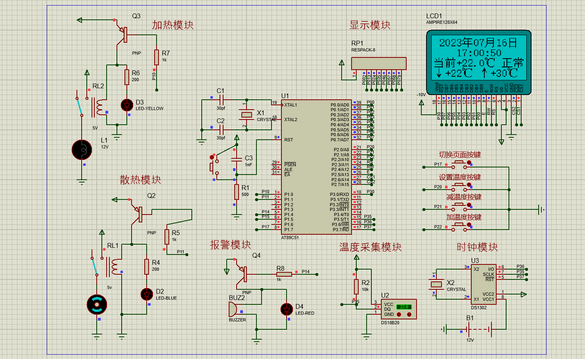
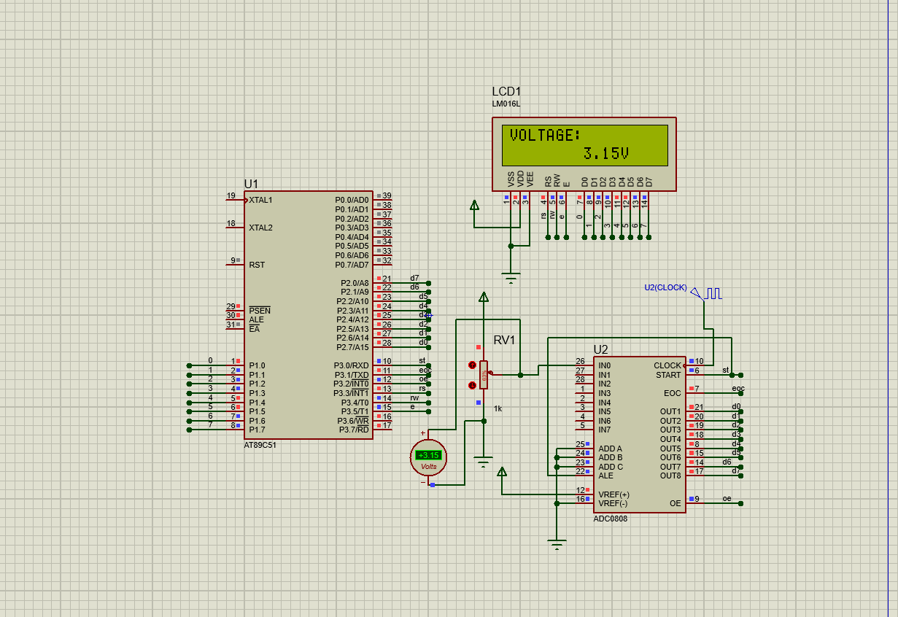

<h1 align="center">
51单片机Proteus仿真
 </h1>

## 项目简介

&emsp;&emsp;此项目开发环境采用**keil5**与**Proteus8.9**进行51单片机仿真实验。项目编写了众多demo，包括温控系统、AD转换、抢答器等诸多仿真。仿真程序均采用C语言进行编写，项目中demo根据所涉及元器件多少以及复杂程度由易到难设计，可供参考学习。

## 部分成果展示

- 温控系统

- AD转换

**其余demo不作展示，自行仿真运行**

> 注：温控系统中*lcd12864*汉字取模软件需baidu自行下载